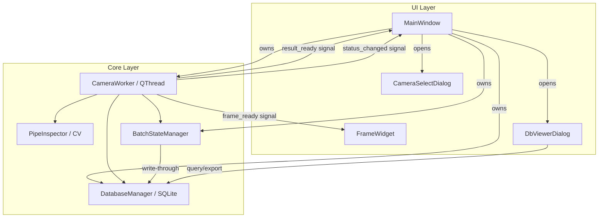
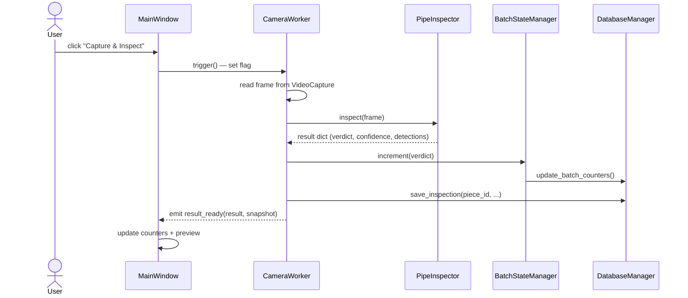
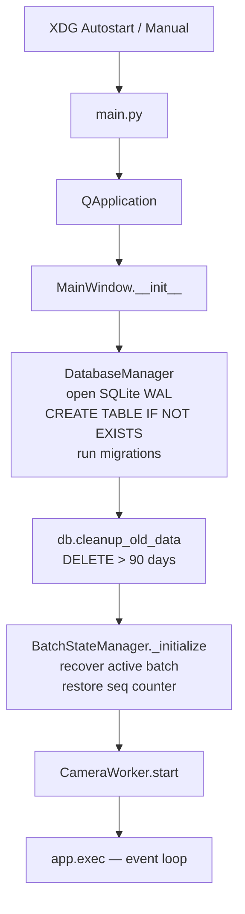
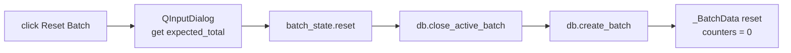
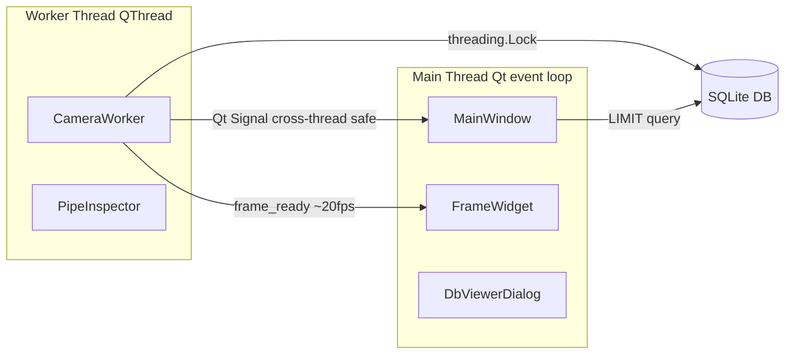

# Architecture

ระบบ Pipe Inspector (PySide6) บน Jetson Orin Nano

---

## System Overview

---

## Component Responsibilities

| Component | ไฟล์ | หน้าที่ |
|---|---|---|
| `MainWindow` | `ui/main_window.py` | Owner ทุกอย่าง, wiring signals, button handlers |
| `FrameWidget` | `ui/frame_widget.py` | QPainter canvas แสดง live frame + bbox overlay |
| `DbViewerDialog` | `ui/db_viewer.py` | ดู/ลบ/export ข้อมูล batch |
| `CameraWorker` | `core/pipeline.py` | QThread — capture, inspect, emit signals |
| `PipeInspector` | `core/pipeline.py` | OpenCV defect detection (HoughCircles + Threshold) |
| `BatchStateManager` | `core/batch_state.py` | In-memory counter + write-through to DB |
| `DatabaseManager` | `core/database.py` | SQLite WAL, threading.Lock, migrations |

---

## Signal Flow

### Capture Workflow

### Startup Workflow

### Reset Batch Workflow

---

## Thread Model

**Key rules:**
- UI updates เกิดใน main thread เท่านั้น (Qt requirement)
- DB access ทุกทางผ่าน `threading.Lock` (single writer = CameraWorker)
- `WAL mode` ให้ DbViewer อ่านพร้อม worker เขียนได้

---

## Design Rationale

| Decision | ทำไม | ทางเลือกที่ปฏิเสธ |
|---|---|---|
| QThread + Qt Signals | UI ไม่ freeze ตอน inference (~150ms), auto-queue ข้าม thread | asyncio — loop ไม่เข้ากัน; multiprocessing — overhead |
| SQLite + WAL | concurrent read ขณะเขียน, single file, zero-config | Postgres — overkill; JSON file — ไม่ atomic |
| threading.Lock บน connection | single writer (worker thread) เพียงพอ | connection pool — ไม่คุ้ม |
| In-memory state + write-through | อ่าน counter เร็ว, DB เป็น source of truth ตอน recovery | เขียน DB ทุก read — slow |
| Base64 JPEG ใน DB | atomic กับ metadata, backup ก็อปไฟล์เดียว | path เก็บแยก — race condition cleanup |
| seq แยกจาก total | piece_id ต้อง unique แม้หลังลบ record | COUNT(*) — ลบแล้ว counter ลด → ID ชน |
| OK Sampling (every-N + ratio cap) | เก็บ NG ครบ, OK สุ่มพอเทียบได้ ไม่กินที่ | เก็บทุกชิ้น — SD เต็มเร็ว |

---

## Edge Cases

### 🔴 HIGH Severity

| Case | ผลกระทบ | Mitigation |
|---|---|---|
| Multiple instances พร้อมกัน | seq ชน, DB lock contention | **P0**: QLockFile (`/tmp/pipe-inspector.lock`) |
| Clock skew (ไม่มี RTC battery) | timestamp ย้อนกลับ → cleanup ลบผิด | NTP sync ตอน boot |
| Storage full mid-save | record หาย, counter inconsistent | try/except รอบ save + rollback |
| Camera unplug ขณะรัน | UI ค้าง preview เก่า | health check + reconnect loop |

### 🟡 MEDIUM Severity

| Case | ผลกระทบ | Mitigation |
|---|---|---|
| Worker shutdown timeout | DB write ไม่จบ | QThread.wait(timeout) + flush ใน closeEvent |
| DB corruption | เปิดไม่ได้ | WAL ลดความเสี่ยง + nightly backup |

---

## P0 Production Checklist

- [ ] Single-instance lock (`QLockFile`)
- [ ] try/except รอบ `save_inspection` + rollback
- [ ] Nightly DB backup (cron/systemd timer)
- [ ] Camera health check + auto-reconnect + UI indicator
- [ ] NTP sync ที่ Jetson boot

ดูตัวอย่าง code สำหรับแต่ละรายการได้ที่ [Deployment Guide](deployment.md#p0-hardening)
