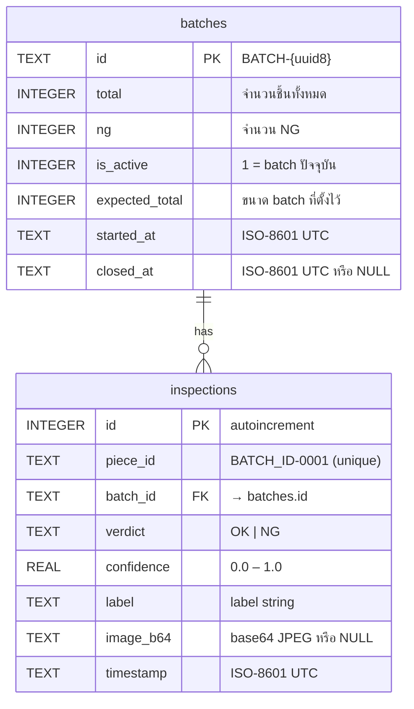

# Database

SQLite database สำหรับ Pipe Inspector — schema, queries, backup, cleanup

---

## Location

```
data/pipe_inspector.db   ← สร้างอัตโนมัติครั้งแรกที่รัน (อย่า commit โฟลเดอร์นี้)
```

## Schema



---

## Common Queries

### ดูข้อมูล batch ทั้งหมด
```sql
SELECT id, total, ng, is_active, expected_total, started_at
FROM batches
ORDER BY started_at DESC;
```

### ดูผลการตรวจ 20 รายการล่าสุด
```sql
SELECT piece_id, verdict, confidence, timestamp
FROM inspections
ORDER BY id DESC
LIMIT 20;
```

### คำนวณ NG Rate ของ batch ที่ระบุ
```sql
SELECT
    id,
    total,
    ng,
    ROUND(CAST(ng AS REAL) / NULLIF(total, 0) * 100, 2) AS ng_rate_pct
FROM batches
WHERE id = 'BATCH-XXXXXXXX';
```

### Export ผลทั้งหมดของ batch
```sql
SELECT i.piece_id, i.verdict, i.confidence, i.timestamp
FROM inspections i
JOIN batches b ON i.batch_id = b.id
WHERE b.id = 'BATCH-XXXXXXXX'
ORDER BY i.id;
```

---

## เปิด DB โดยตรง (CLI)

```bash
sqlite3 data/pipe_inspector.db

.tables                          -- ดูตารางทั้งหมด
.schema inspections              -- ดู schema
PRAGMA journal_mode;             -- ควรได้ "wal"
.quit
```

---

## Cleanup

ระบบลบข้อมูลเก่าอัตโนมัติ**ทุกครั้งที่เปิดโปรแกรม** (ไม่ต้องพึ่ง cron)

```python
# core/database.py
DELETE FROM inspections WHERE timestamp < datetime('now', '-90 days')
```

### ลบ batch เก่า (manual)

> ⚠️ ปิดโปรแกรมก่อนแก้ DB ทุกครั้ง

```bash
python3 - <<'EOF'
import sqlite3
conn = sqlite3.connect("data/pipe_inspector.db")
conn.execute("""
    DELETE FROM inspections
    WHERE batch_id IN (SELECT id FROM batches WHERE is_active = 0)
""")
conn.execute("DELETE FROM batches WHERE is_active = 0")
conn.commit()
conn.close()
print("Done")
EOF
```

---

## Backup

### Manual backup
```bash
sqlite3 data/pipe_inspector.db ".backup data/backup_$(date +%Y%m%d).db"
```

### Automated (cron ทุกคืน 02:00)
```bash
# เพิ่มใน crontab: crontab -e
0 2 * * * sqlite3 /home/jetson/Praram9/PySide/data/pipe_inspector.db \
    ".backup /home/jetson/backups/pipe_$(date +\%Y\%m\%d).db"

# ลบ backup เก่ากว่า 7 วัน
0 3 * * * find /home/jetson/backups/ -name "pipe_*.db" -mtime +7 -delete
```

---

## Migrations

`DatabaseManager` จัดการ migration ด้วย `ALTER TABLE ... ADD COLUMN` + duplicate guard  
ปลอดภัยที่จะรันซ้ำ (idempotent) — ไม่ลบข้อมูลเดิม

```python
# ตัวอย่างจาก database.py
try:
    conn.execute("ALTER TABLE batches ADD COLUMN expected_total INTEGER DEFAULT 0")
except sqlite3.OperationalError:
    pass  # column already exists — ข้ามได้
```
