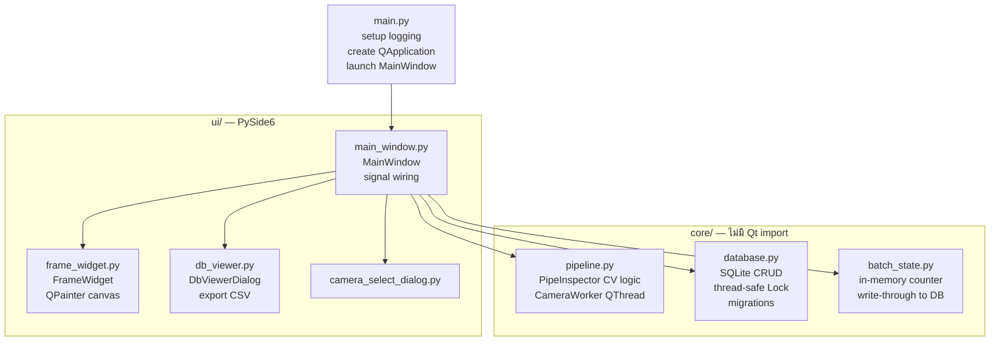

# Development Guide

Setup สำหรับ dev บน PC + วิธีรัน benchmark

---

## Prerequisites

| Tool | Version | หมายเหตุ |
|---|---|---|
| Python | 3.11+ | ใช้ venv แนะนำ |
| OpenCV | 4.9+ | PC: pip / Jetson: apt |
| PySide6 | 6.6+ | pip install |
| SQLite | 3.x | built-in Python |
| Git | - | - |

---

## Setup บน PC (Windows/macOS/Linux)

```bash
# 1. Clone
git clone https://github.com/shootle48/PySide_Pipe
cd PySide_Pipe

# 2. Virtual environment
python -m venv .venv
source .venv/bin/activate      # Linux/macOS
.venv\Scripts\activate         # Windows

# 3. Install dependencies
pip install -r requirements.txt

# 4. ทดสอบ import
python -c "import PySide6; import cv2; import numpy; print('All OK')"

# 5. รัน
python main.py
```

> ไม่มีกล้อง? ใช้ **Upload Image Mode** (ปุ่ม 🖼 Upload Image)

---

## Setup บน Jetson Orin Nano

ดูรายละเอียดที่ [Deployment Guide](deployment.md)

---

## Benchmark (ไม่ต้องมีกล้อง)

วัด inference latency ของ CV pipeline โดยตรง

```bash
# รันกับรูปภาพที่มีอยู่
python scripts/benchmark.py --image /path/to/test.jpg

# รัน 50 ครั้ง
python scripts/benchmark.py --image /path/to/test.jpg --n 50
```

**Output ตัวอย่าง:**
```
Benchmark: 30 runs on test.jpg
  Min:  42.3 ms
  Max:  58.1 ms
  Mean: 47.6 ms
  FPS:  21.0
  CPU:  35%
  RAM:  312 MB
```

---

## Project Config

แก้ค่าได้ที่ต้นไฟล์ `ui/main_window.py`:

```python
CAMERA_INDEX     = 0        # กล้อง index (0, 1, 2, ...)
TRIGGER_MODE     = "manual" # "manual" | "timer" | "gpio"
TIMER_INTERVAL   = 6.0      # วินาที (ใช้เมื่อ TRIGGER_MODE = "timer")
RESULT_VIEW_SECS = 4        # วินาที — แสดงผลก่อนกลับ live view
```

CV constants อยู่ที่ต้นไฟล์ `core/pipeline.py`:

```python
MIN_DEFECT_AREA    = 50    # px² — ignore contours เล็กกว่านี้
INNER_RADIUS_RATIO = 0.5   # fraction ของ pipe radius ที่ inspect
JPEG_QUALITY       = 85    # คุณภาพรูปที่บันทึกลง DB
OK_SAMPLE_EVERY_N  = 50    # ทุก N ชิ้น OK จึง save 1 รูป
MAX_OK_NG_RATIO    = 1.5   # จำกัด OK/NG ratio ใน storage
```

---

## Logging

Log ออก 2 ที่พร้อมกัน:

| ที่ | Format | ใช้สำหรับ |
|---|---|---|
| Console (stderr) | `HH:MM:SS | LEVEL | name | msg` | Dev / debug |
| `logs/app.log` | `YYYY-MM-DD HH:MM:SS | LEVEL | name | msg` | Production / post-mortem |

Log rotate อัตโนมัติ: 5 MB × 5 ไฟล์ = เก็บสูงสุด ~25 MB

```bash
# ดู log แบบ live
tail -f logs/app.log

# กรองเฉพาะ WARNING ขึ้นไป
grep -E "WARNING|ERROR|CRITICAL" logs/app.log
```

---

## Code Structure (Quick Reference)



---

## Contributing

1. Fork → branch จาก `main`
2. ชื่อ branch: `feat/xxx` / `fix/xxx` / `refactor/xxx`
3. Commit ตาม conventional format: ดู [commit.md](../.claude/commands/commit.md)
4. PR → เขียน description + test ที่ทำแล้ว
5. **ห้าม commit** `logs/`, `exports/`, `data/`, `__pycache__/`
