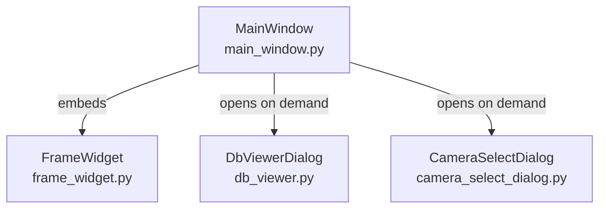

# ui/ — PySide6 UI Layer

Package นี้รวม Qt widgets และ dialogs ทั้งหมด  
ทุก component สื่อสารกับ `core/` ผ่าน **Qt Signals/Slots** เท่านั้น

---

## Components



---

### `main_window.py` — MainWindow

หน้าต่างหลักของโปรแกรม — เป็น owner ของทุก component

**Layout:**
```
┌─────────────────────────────────────┐
│  [Counters] Total | NG | NG Rate    │
│  [FrameWidget] Live / Result view   │
│  [History] รายการตรวจล่าสุด         │
│  [Buttons] Capture | Reset | DB...  │
└─────────────────────────────────────┘
```

**Config constants (ต้นไฟล์):**
```python
CAMERA_INDEX     = 0        # USB camera index
TRIGGER_MODE     = "manual" # "manual" | "timer" | "gpio"
TIMER_INTERVAL   = 6.0      # วินาที (timer mode)
RESULT_VIEW_SECS = 4        # วินาทีแสดงผลก่อนกลับ live
```

**Slots ที่รับ signal จาก CameraWorker:**

| Slot | Signal | หน้าที่ |
|---|---|---|
| `_on_frame_ready` | `frame_ready` | ส่ง frame ไป FrameWidget |
| `_on_result_ready` | `result_ready` | อัป counter + preview |
| `_on_status_changed` | `status_changed` | แสดงสถานะ LIVE/PROCESSING/IDLE |

---

### `frame_widget.py` — FrameWidget

Canvas สำหรับแสดงภาพ live และผลการตรวจ

- รับ `np.ndarray` BGR → แปลงเป็น `QPixmap` → วาดด้วย `QPainter`
- วาด bounding box + label ทับบนภาพ
- รองรับทั้ง live stream (~20 fps) และ result snapshot

---

### `db_viewer.py` — DbViewerDialog

QDialog สำหรับดูข้อมูลใน SQLite

**Features:**
- แสดง batch list พร้อม total/NG/NG rate
- คลิก batch → แสดง inspection records
- Export CSV (UTF-8 BOM — รองรับ Excel)
- ลบ inspection records ที่เลือก

---

### `camera_select_dialog.py` — CameraSelectDialog

QDialog สำหรับเลือกกล้องจาก available cameras

---

## Rules

- ✅ UI updates ต้องเกิดใน **main thread** เสมอ (Qt requirement)
- ✅ รับ data จาก `core/` ผ่าน **Qt Signals** (thread-safe)
- ❌ ห้าม call `core/` functions โดยตรงจาก worker thread อื่น
- ❌ ห้าม block main thread (ห้าม `time.sleep`, ห้าม heavy computation)
